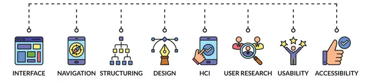

# UX Design

### **Этапы работы**

1. **Анализ целевой аудитории**. Для того чтобы создать максимально удобное приложение или сайт, дизайнеру необходимо определить, кто будет им пользоваться, то есть создать портрет целевой аудитории. Например, приложение доставки пиццы делается для более широкой ЦА, а сайт с библиотекой материалов по молекулярной физике — для более узкой. Следовательно, и к их созданию нужен разный подход.
2. **Анализ конкурентов**. Изучение достоинств и недостатков конкурентов позволяет продумать, как сделать так, чтобы ваш продукт отличался от других: что можно создать такого, чего еще ни у кого нет. Также это помогает не допустить те же ошибки, что и конкуренты.
3. **Разработка структуры будущего сайта или приложения**. 
    
    
    
    Дизайнер определяет, каким будет конечный продукт: какие данные разместить на каждой странице и как создать логичные переходы. Кроме того, иногда на этом этапе разрабатывается Customer Journey Map — карта пользовательских путей. Она должна отвечать на вопросы, как пользователь попадает на сайт, что может оттолкнуть его от совершения покупки или приобретения услуги и так далее.
    

1. **Прототипирование**. На этом этапе начинается создание варфрейма — проще говоря, наброска будущего продукта. Он не должен быть детализированным. Главное, чтобы было понятно, как будет работать сайт или мобильное приложение, и были отражены все основные элементы. Затем создается макет: добавляются логотипы, картинки, тексты. И завершающая часть на этом этапе — разработка интерактивного прототипа, то есть уже полноценной модели будущего продукта. Теперь можно протестировать, как работают кнопки.
    
    
    
2. **Тест**. Перед тем, как выпустить конечный продукт, его обязательно тестируют, чтобы выявить возможные ошибки. Для этого привлекают пользователей из целевой аудитории. На основе их отзывов дизайнер исправляет или дорабатывает сайт, или приложение.
3. **Развитие и доработка**. После выпуска продукта дизайнер продолжает работу над ним. Например, добавляет новые страницы или обновляет дизайн, чтобы он не выглядел устаревшим и несовременным.

### Tools

- Figma — для создания прототипов и макетов сайтов;
- Adobe Photoshop — для работы с растровой графикой;
- Adobe Illustrator, Sketch — для создания векторной графики;
- Adobe XD — для разработки интерфейсов;
- Adobe After Effects — для создания анимированных элементов интерфейса;
- Tilda — для быстрого создания простых сайтов;
- UserTesting, Crazy Egg, Usabilla, Userlytics, UsabilityHub — для тестирования продукта.