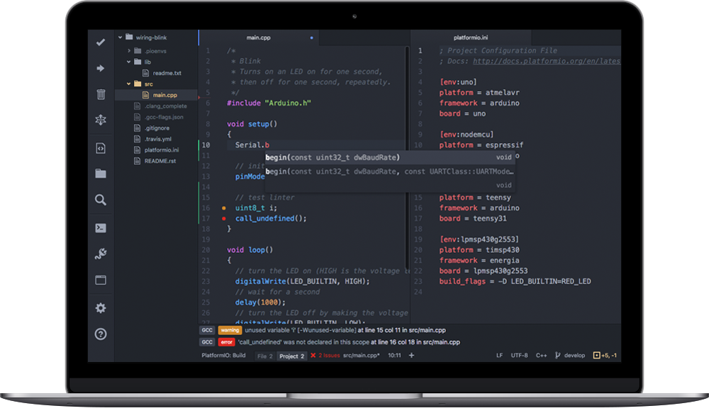
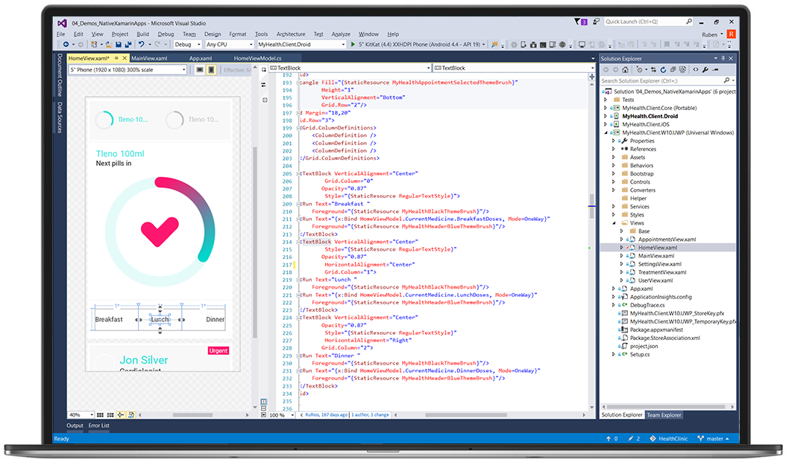

# Разработка/Implementation

## Codding Process Description

- Writing Code
- CI / CD
- Code Quality
- Code Review
- Документация
- Extream Programming
- Инструменты: Среда разработки
    - IDE
    - Vevrsion Control

### Writing Code

- ✍️ coding - писательство, пишем текст
- 🪲 bugs - неисправность, ошибка разработчика, ошибка в коде
- 🔧 fix - исправление бага
- 🩼 костыль - плохое исправление/решение, которое потом придется заменять
- ➰ work around - другой способ сделать то что требуется
- 🕵️ troubleshooting - поиск неисправности, попытка её воспроизвести
- 🔬debuging - пошаговая проверка того как код работает
- 🔄 refactoring - изменения кода, не меняя того как он работает/что делает
- 📜 code style/convention/guide lines

### CI / CD

<aside>
‼️

Why we need?

</aside>

- Environments - сервер или окружение, в котором запускается приложение
    - Development - это сервера где хозяйничают разработчики, там может быть лютый хаос потому что все в работе
    - Testing - это сервера, которые выдели для тестировщиков чтобы они тестировали приложение. Приложение там работает нормально но из-за того что его постоянно пытаются сломать выглядеть оно может не привлекательно.
    - Staging или Pre-production - окружение где мы даем реальным пользователям попробовать продукт
    - Production - это уже пользовательское окружение
    - Варианты:
        
        
        
        
        
- DevOps - автоматизация запуска приложение
- CI - Continues Integration - постоянно пытаемся собрать не сервере приложение и запустить его

- CD -
    - CD - Continues Delivery = CI + загрузка приложения на реальные сервера
    - CD - Continues Depoyment = CDelivery + запуск загруженного приложения

- Pipeline - цепочка шагов которую выполняет CI сервер
- Tools: Jenkins, GitHub Actions, GitLab

### Code Quality

- Unit Tests - это тоже код, пишем код, который проверяет код
- TDD - сначала пишем тесты, потом только код приложения
- BDD - TDD только вместо тестов пишем спецификацию, т.е. автоматизируем пользовательские сценарии

### Code Review

**Code review (перевод - проверка кода)** - инженерная практика в терминах гибкой методологии разработки. Это анализ (инспекция) кода с целью выявить ошибки, недочеты, расхождения в стиле написания кода, в соответствии написанного кода и поставленной задачи.

К очевидным плюсам этой практики можно отнести:

- Улучшается качество кода;
- Находятся «глупые» ошибки (опечатки) в реализации;
- Повышается степень совместного владения кодом (практика, при которой все члены команды разработки в равной степени ответственны за весь код проекта);
- Код приводится к единому стилю написания;
- Хорошо подходит для обучения «новичков», быстро набирается навык, происходит выравнивание опыта, обмен знаниями.

Процедура code review может проводиться как в ручном режиме опытными разработчиками или руководителями команд (teamlead), так и автоматизированно с помощью статических анализаторов кода. Такие системы автоматически проверяют весь исходный код проекта по набору предустановленных правил. Система успешно находит:

- опечатки,
- некорректно используемые вызовы функций,
- повторы одинаковой функциональности,
- неправильное следование правилам форматирования кода, принятые на проекте
- и другие возможные правила.

У нас в компании используется статический анализатор кода SonarQube практически на каждом из проектов для достижения максимального качества исполнения.

### Документация

### Extream Programming

- **Pair programming**
- **Planning game**
- **Test driven development**
- **Continuous integration**
- **Code refactoring**

## **Инструменты: Среда разработки**

Работу программиста невозможно обеспечить одним лишь языком программирования. Программы нужно где-то писать, с помощью чего-то компилировать или интерпретировать, собирать воедино, запускать, а также находить и исправлять ошибки. Все эти потребности покрывает среда разработки.

### IDE

**Интегрированная среда разработки**, **ИСP/IDE** (англ. Integrated development environment) — комплекс программных средств, используемый программистами для разработки программного обеспечения.

Среда разработки включает в себя:

- текстовый редактор;
- компилятор и/или интерпретатор;
- средства автоматизации сборки;
- отладчик.

Иногда содержит также средства для интеграции с системами управления версиями и разнообразные инструменты для упрощения конструирования графического интерфейса пользователя. Многие современные среды разработки также включают браузер классов, инспектор объектов и диаграмму иерархии классов — для использования при объектно-ориентированной разработке ПО. IDE обычно предназначены для нескольких языков программирования — такие как IntelliJ IDEA, NetBeans, Eclipse, Qt Creator, Geany, Embarcadero RAD Studio, Code::Blocks, Xcode или Microsoft Visual Studio, но есть и IDE для одного определенного языка программирования — как, например, Visual Basic, Delphi, Dev-C++.

Частный случай IDE — среды визуальной разработки, которые включают в себя возможность визуального редактирования интерфейса программы.

### Vevrsion Control (GitHub / ...)

[https://www.youtube.com/watch?v=RIjg6XsRJNQ&ab_channel=MerionAcademy](https://www.youtube.com/watch?v=RIjg6XsRJNQ&ab_channel=MerionAcademy)

[https://www.youtube.com/watch?v=EeARyFrZsnU&ab_channel=MerionAcademy](https://www.youtube.com/watch?v=EeARyFrZsnU&ab_channel=MerionAcademy)

### **Системы контроля версий, Git**

При совместном программировании проекта одни разработчики запросто могут испортить работу других, если будут действовать несогласованно. Кроме того, любые изменения в коде могут вызвать внезапные проблемы работоспособности проекта, а это обычно весьма затратно. Да и выяснить, кто из команды разработки виноват в возникших внезапно проблемах, без дополнительных средств чрезвычайно сложно. Чтобы подобных проблем не возникало, широко применяют системы контроля версий.

**Система контроля версий** — это система, записывающая изменения в файл или набор файлов в течение времени и позволяющая вернуться позже к определенной версии. В качестве изменений в разработке ПО обычно принимаются изменения в исходном коде этого программного обеспечения, хотя на самом деле вы можете использовать контроль версий практически для любых типов файлов и операций.

Применение контроля версий обусловлено основной особенностью разработки ПО как проектной деятельности. Работа ведется в условиях высокой неопределенности, а каждые последующие изменения могут сильно влиять на предыдущие действия, причем чаще в негативном ключе. Другими словами, если после внесения определенных изменений в код все резко стало работать намного хуже, первый и наиболее действенный способ исправления – откатить эти изменения назад. Аналогичная потребность возникает и в том случае, если заказчик передумал и требует «…вернуть все, как было раньше!».

Наиболее популярной в среде разработки ПО системой контроля версий является **Git**. Изначально проект разработал Линус Торвальдс – легендарный создатель первого ядра Linux. На данный момент его поддерживает другой известный программист Джунио Хамано.

[https://book.git-scm.com/book/ru/v1/%D0%92%D0%B2%D0%B5%D0%B4%D0%B5%D0%BD%D0%B8%D0%B5-%D0%9E-%D0%BA%D0%BE%D0%BD%D1%82%D1%80%D0%BE%D0%BB%D0%B5-%D0%B2%D0%B5%D1%80%D1%81%D0%B8%D0%B9](https://book.git-scm.com/book/ru/v1/%D0%92%D0%B2%D0%B5%D0%B4%D0%B5%D0%BD%D0%B8%D0%B5-%D0%9E-%D0%BA%D0%BE%D0%BD%D1%82%D1%80%D0%BE%D0%BB%D0%B5-%D0%B2%D0%B5%D1%80%D1%81%D0%B8%D0%B9)

Система спроектирована как набор программ, специально разработанных с учетом их использования в скриптах. Это позволяет удобно создавать специализированные системы контроля версий на базе Git или пользовательские интерфейсы. Например, Cogito является именно таким примером оболочки к репозиториям Git, а StGit использует Git для управления коллекцией исправлений (патчей).

Git поддерживает быстрое разделение и слияние версий, включает инструменты для визуализации и навигации по истории разработки. Система предоставляет каждому разработчику локальную копию всей истории разработки, изменения копируются из одного репозитория в другой. Каждое отдельное изменение, вносимое в систему, называется **коммит** (commit).

Преимущества Git:

- Высокая производительность;
- Развитые средства интеграции с другими подобными системами;
- Продуманная система команд, позволяющая удобно встраивать git в скрипты;
- Качественный веб-интерфейс «из коробки»;
- Репозитории git могут распространяться и обновляться общесистемными файловыми утилитами архивации и обновления.

Недостатки Git:

- Отсутствие сквозной нумерации коммитов монотонно непрерывно возрастающими целыми числами;
- Отсутствие переносимой на другие операционные системы поддержки путей в кодировке Unicode в Microsoft Windows;
- Некоторое неудобство для пользователей, переходящих с других подобных систем из-за ориентированности на команды, а не на файлы;
- Использование для идентификации ревизий хешей SHA1, что приводит к необходимости оперировать длинными строками вместо коротких номеров версий;
- Несколько более высокие, чем в других системах, накладные расходы при работе с проектами, в которых делаются многочисленные не связанные между собой изменения файлов;
- Отсутствие отдельной команды переименования/перемещения файла, которая отображалась бы в истории как соответствующее единое действие;
- Система работает только с файлами и их содержимым, и не отслеживает пустые каталоги.