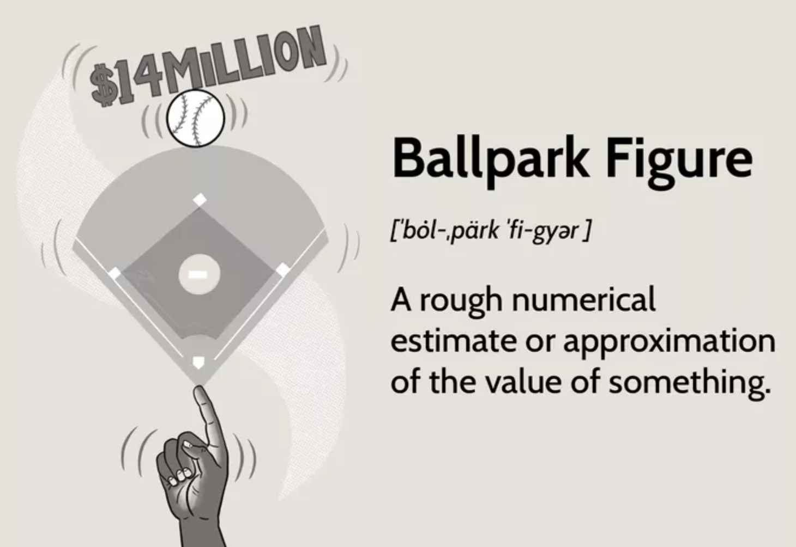

# Планирование

## Estimation

**Ballpark** 

Оценка Ballpark основана на высокоуровневых целях, дает общее представление о результатах проекта и имеет много места для маневра. Большинство оценок Ballpark, в зависимости от отрасли, имеют диапазон отклонений от -25% вплоть до +75%. Менеджер проекта не должен тратить слишком много времени на создание этих первоначальных оценок, так же как и заказчик не должен слишком доверять точности такой оценки. 

К сожалению для обеих сторон, существует постоянный сбой в ожиданиях, когда дело доходит до оценок Ballpark. Обычно менеджер проекта слепо выбрасывает оценку Ballpark, как невеста бросает свой букет, а заказчик цепляется за букет Ballpark, как подружка невесты на той же свадьбе. Оценки Ballpark, независимо от вашей роли в проекте, предназначены просто для визуального определения первоначальных предполагаемых затрат проекта.

**Detailed** 

Когда клиенты думают об оценках, они обычно думают в терминах подробной оценки, где они могут знать стоимость продукта заранее и могут быть уверены, что она не увеличится существенно.

Подробную оценку проще всего сделать для небольших, четко определенных проектов, таких как веб-сайты и небольшие продукты, где результат четко определен, а проект составляет 100 часов или меньше. Когда вы начинаете выходить за рамки 100 часов работы, начинает появляться погрешность, и такие оценки могут стать крайне неточными, если они не сделаны очень тщательно.

**Flexible** 

Третий тип оценки, который мы используем, называется «гибкая оценка». Это наиболее распространенный подход к оценке и созданию сложного программного обеспечения, особенно для проектов в диапазоне 500+ часов.

Благодаря гибкой смете мы быстрее погружаемся в разработку и каждую неделю дорабатываем работу предыдущей недели. Поскольку новый код поставляется каждые 2 недели, вы сможете предоставить много информации и рекомендаций о том, что было создано, что поможет направить продукт к желаемому результату. Во время этих еженедельных встреч вы можете удалить, изменить или добавить новые функции в любое время. Вы можете контролировать бюджет, указывая, что вы хотите создать, а что нет. Функции можно отложить или пропустить. По мере продолжения еженедельных встреч и клиент, и поставщик выстраивают тесную связь, где обе стороны работают над одними и теми же целями.

Этот гибкий подход — способ создания большинства программного обеспечения в Кремниевой долине. Это идеальный подход, поскольку вы платите только за выполненную работу и можете изменить объем работы в любое время. Основное внимание уделяется созданию минимально жизнеспособного продукта и быстрому выводу его на рынок для получения отзывов клиентов.

## WBS

**Work Breakdown Structure или ИСР, Иерархическая Структура Работ** – это разбиение проекта на конкретные результаты, которые должны быть достигнуты для достижения целей проекта. 

WBS – крайне полезная вещь в планировании проекта и вот почему:

1. WBS – если не единственный, но точно самый эффективный способ наглядно отразить весь объем проекта.
2. WBS фокусирует внимание не на процессе а на ожидаемом результате, и создает нужный «посыл».
3. В идеале в разработке WBS участвует заказчик или его представитель и вся команда, что позволяет а) обеспечить единое понимание результатов проекта и его объема б) увидеть важность и вклад отдельных элементов в общий результат
4. С помощью WBS можно наглядно обосновать необходимости в финансах или человеческих ресурсах, так как против конкретного описанного объема возражать гораздо сложнее, чем против «да что там системку написать, посадите программиста и все».
5. WBS помогает предотвратить риски и изменения или по крайней мере значительно (очень значительно!) снизить их вероятность и влияние, так как именно здесь всплывут многие неочевидные ранее вещи и «а мы хотели совсем другое» (и так и должно быть, для этого инструмент и предназначен).
6. На уровне WBS уже можно определить и согласовать контрольные точки проекта (как для решений о продолжении проекта после очередного этапа, так и для контроля затрат человеческих и финансовых ресурсов).

Уже на этом этапе хорошо бы донести до заказчика вашу позицию «**Если задач нет в WBS – их нет и в проекте»**. Во-первых, все постараются при разработке или при согласовании немного больше, а во вторых – у вас появится хороший рычаг влияния на будущее.

### **Группировка и декомпозиция WBS**

Первый вопрос, который возникает в начале создания WBS – **как группировать элементы WBS**, по какому принципу?

Способ группировки, как правило, выбирается в зависимости от проекта, основной критерий тут – чтобы было понятно вам и команде.

**Классические варианты группировки WBS:**

1. **По стадиям жизненного цикла проекта** (например, отдельно описываются результаты фаз планирования, анализа, разработки, приемки и проч.) – это самый простой и популярный подход, особенно если проект идет по утвержденному процессу и всем понятно, что должно быть на выходе какой фазы.
2. **По высокоуровневым результатам проекта** (проект разбивается на ключевые результаты, например, готовая система, обученные пользователи, разработанная нормативная документация, согласованное использование системы с государственными органами и проч.) – я чаще всего использую именно этот вариант, мне нравится видеть конкретные результаты проекта и, на мой взгляд, этот формат лучше понимает заказчик.
3. **По организационной структуре** (например, вы, заказчик, подрядчик(и) и проч.) – этот вариант удобен, когда вам надо жестко разграничить ответственность за результаты работ.
4. **Про срокам** (например, по кварталам) – если для проекта критична привязка к срокам.
5. **По техническим областям** (производство, маркетинг, закупки и проч.)
6. **По источникам финансирования** (какая часть результатов за какие средства достигается или за бюджет какого года, например).
7. **По странам** (такое видела однажды всего на одном из международных проектов, и показалось крайне неудобным).

Одним словом – можно любой свой вариант придумать, лишь бы было удобно.

Второй любимый вопрос начинающего PMа – **до какой степени нужно детализировать WBS**? Забавно, но правильного ответа  на этот вопрос не существует. Степень декомпозиции зависит как от размера, так и от типа проекта, а также от количества времени, которое вы можете потратить на проработку.

**Хочешь почитать больше?** 

- https://www.jaroeducation.com/blog/work-breakdown-structure-in-project-management/
- https://slidemodel.com/how-to-work-breakdown-structure-wbs/

## Gantt chart

Диаграммы Ганта — это инструмент управления проектами, иллюстрирующий то, как выполняется запланированная работа с течением времени. Обычно она состоит из двух частей: в левой части приведен список заданий, а в правой — временная шкала с полосами, которые изображают работу. Диаграмма Ганта также может включать даты начала и завершения заданий, контрольные точки, зависимости между заданиями и исполнителей.

Сейчас диаграммы Ганта часто называют инструментами для составления дорожных карт. Чтобы не отставать от требований разработки современного программного обеспечения, инструменты для составления дорожных карт, такие как Jira, содержат раскрывающиеся списки заданий, панели управления ресурсами и подобные функции. Это помогает командам придерживаться единой стратегии проекта, несмотря на итеративный характер разработки ПО. В Jira включены два инструмента составления дорожных карт, позволяющих создавать диаграммы Ганта для проектов: Хронологии, с помощью которых можно формировать планы на основе задач Jira, назначенных одной команде, и Планы с теми же функциями, но для нескольких команд и организаций.

## Roadmap / Milestones

**Roadmap**. Дорожная карта похожа на краткое изложение большого романа, которое можно прочитать за 15 минут и составить общее представление о сюжете и героях. Roadmap помогает всем участникам проекта «читать» его и понимать, на каком этапе он находится. Вот как дорожные карты помогают командам двигаться к цели:

- **Следить, чтобы проект развивался по намеченному плану.**
    
    Например, в новогоднем спецпроекте разработчики начали внедрять форму для заполнения данных, чтобы собирать email-адреса участников акции и потом сделать рассылку. Но позже выяснилось, что приоритетом акции был охват новой аудитории и рассылки не должно было быть. А разработчики уже настроили хостинг. Чтобы не тратить ресурсы команды зря, нужно периодически сверяться с roadmap проекта.
    
- **Контролировать сроки.**
    
    Важно, чтобы доступ к дорожной карте был у всех участников. Тогда каждый может сверяться по ней с этапом или сроками. Например, если команда дизайнеров понимает, что надо сдвинуть день показа первой версии прототипа, то вносит изменения в дорожную карту. Разработчики видят изменения и переносят вёрстку на другой день.
    
    Дорожная карта даёт глобальное понимание того, на какой стадии находится проект, поэтому её удобно показывать руководителю, заказчику или инвестору. Как правило, им важно понимать, что происходит, но при этом необязательно вникать в детали.
    
- **Разрабатывать план проекта.**
    
    Дорожная карта — стартовая точка проекта. Если декомпозировать её на более мелкие цели, задачи и этапы, получится полноценный план, который можно использовать в работе над проектом.
    

**Milestone** — это контрольные точки проекта. Такие чек-пойнты на дорожной карте, после прохождения которых можно зафиксировать прогресс, подвести промежуточные итоги.

Это могут быть дедлайны или завершение части проекта — например, выпуск MVP или большой прирост функций. По вехам проект планомерно движется из точки А в точку Б.

## Backlog

Бэклог продукта - это перечень задач, расположенных в порядке важности, для команды разработчиков. Его составляют на основе дорожной карты продукта и требований в ней. Наиболее важные элементы расположены в начале бэклога, чтобы команда понимала, чем следует заняться в первую очередь. Скорость, с которой участники выполняют задачи бэклога, не зависит от желаний владельца продукта, и он не должен оказывать давление на команду. Напротив, разработчики самостоятельно выбирают задачи из бэклога продукта с учетом доступных ресурсов. Работа при этом ведется непрерывно (Kanban) либо в рамках итераций (Scrum).