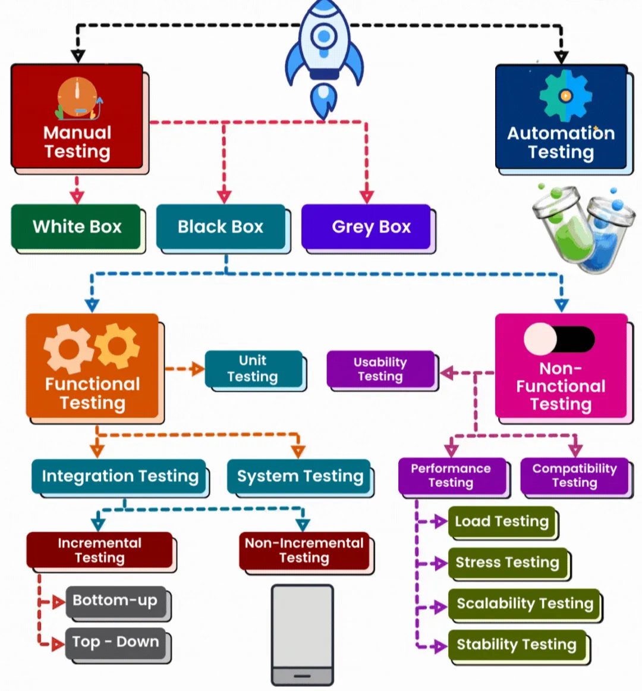
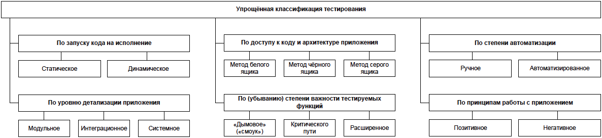

# Тестирование, качество, QA

Любое ПО, даже самое простое, может в различных ситуациях вести себя непредсказуемо. Техническое задание часто покрывает только стандартные ситуации (happy path), предусмотренные заранее, в то время как в нестандартных условиях (exceptional cases) предугадать поведение программы зачастую невозможно. Кроме того, сложные программные системы могут даже в стандартных условиях выполнять не те действия, которые на них возложены, и не так, как этого бы хотелось разработчикам.

**Тестирование программного обеспечения** — процесс анализа программного средства и сопутствующей документации с целью выявления дефектов и повышения качества продукта.

**Тестирование** позволяет:

- удостовериться, что программа соответствует требованиям;
- определить условия, при которых программа ведет себя некорректно.

**QA (Quality Assurance)** — обеспечение качества.

Охватывает весь цикл разработки ПО и затрагивает процессы 

- планирования
- проектирования
- создания и выполнения тест-кейсов
- поддержку имеющихся тест-кейсов и тестовых окружений.

# Какие бывают виды тестирования

**По запуску кода на исполнение:**

- Статическое тестирование — без запуска.
- Динамическое тестирование — с запуском.

**По доступу к коду и архитектуре приложения:**

- Метод белого ящика — доступ к коду есть.
- Метод черного ящика — доступа к коду нет.
- Метод серого ящика — к части кода доступ есть, к части — нет.

**По степени автоматизации:**

- Ручное тестирование — тест-кейсы выполняет человек.
- Автоматизированное тестирование — тест-кейсы частично или полностью выполняет специальное инструментальное средство.

**По уровню детализации приложения (по уровню тестирования):**

- Модульное (компонентное) тестирование — проверяются отдельные небольшие части приложения.
- Интеграционное тестирование — проверяется взаимодействие между несколькими частями приложения.
- Системное тестирование — приложение проверяется как единое целое.

**По убыванию степени важности тестируемых функций (по уровню функционального тестирования):**

- Дымовое тестирование (smoke) — проверка самой важной, самой ключевой функциональности, неработоспособность которой делает бессмысленной саму идею использования приложения.
- Тестирование критического пути — проверка функциональности, используемой типичными пользователями в типичной повседневной деятельности.
- Расширенное тестирование — проверка всей (остальной) функциональности, заявленной в требованиях.

**По принципам работы с приложением:**

- Позитивное тестирование — все действия с приложением выполняются строго по инструкции без никаких недопустимых действий, некорректных данных и т. д. Можно образно сказать, что приложение исследуется в “тепличных условиях”.
- Негативное тестирование — в работе с приложением выполняются (некорректные) операции и используются данные, потенциально приводящие к ошибкам (классика жанра — деление на ноль).

## **Наиболее часто используемые виды тестирования**

- **Дымовое тестирование (smoke)** - направлено на проверку самой главной, самой важной, самой ключевой функциональности, неработоспособность которой делает бессмысленной саму идею использования приложения (или иного объекта, подвергаемого дымовому тестированию).
    
    Дымовое тестирование проводится после выхода нового билда, чтобы определить общий уровень качества приложения и принять решение о целесообразности или нецелесообразности выполнения тестирования критического пути и расширенного тестирования. Поскольку тест-кейсов на уровне дымового тестирования относительно немного, а сами они достаточно просты, но при этом очень часто повторяются, они являются хорошими кандидатами на автоматизацию. В связи с высокой важностью тест-кейсов на данном уровне пороговое значение метрики их прохождения часто выставляется равным 100 % или близким к 100 %.
    
- **Регрессионное тестирование** — тестирование, направленное на проверку того факта, что в ранее работоспособной функциональности не появились ошибки, вызванные изменениями в приложении или среде его функционирования.
    
    Фундаментальная проблема при сопровождении программ состоит в том, что исправление одной ошибки с большой вероятностью (20–50 %) влечёт появление новой. Потому регрессионное тестирование является неотъемлемым инструментом обеспечения качества и активно используется практически в любом проекте.
    
- **Автоматизированное тестирование** — набор техник, подходов и инструментальных средств, позволяющий исключить человека из выполнения некоторых задач в процессе тестирования. Тест-кейсы частично или полностью выполняет специальное инструментальное средство, однако разработка тест-кейсов, подготовка данных, оценка результатов выполнения, написания отчётов об обнаруженных дефектах — всё это и многое другое по-прежнему делает человек.
    
    Selenium - наиболее распространенная на сегодняшний день библиотека автоматизированного тестирования web-приложений. По факту она представляет собой модернизированный браузер, который может выполнять написанные тестировщиком сценарии действий.
    
    Имея написанные тесты, мы должны обеспечить возможность их выполнения в Web-браузере. Для этого мы используем Selenium, инфраструктуру автоматизации Web-браузера, хорошо сочетающуюся с Cucumber. Есть два способа управления браузером с помощью Selenium:
    
    1. **Selenium-RC** использует JavaScript для управления Web-страницей и работает внутри песочницы JavaScript.
    2. **WebDriver** использует встроенный механизм автоматизации, который работает быстрее и не так подвержен ошибкам, но поддерживает меньше браузеров.
    
    Приведем пример сценария, который может быть написан с помощью Selenium :
    
    1. Выбрать поле “Логин”;
    2. Ввести в поле значение “test-user”;
    3. Выбрать поле “Пароль”;
    4. Ввести в поле значение “password”;
    5. Нажать кнопку “Войти в систему”;
    6. Если адрес страницы изменился на “[http://facebook/profile](http://facebook/profile)”, считать тест пройденным успешно;
    7. Иначе, считать тест пройденным неуспешно.
    
    Такая последовательность действий будет выполнена в настоящем браузере программой очень быстро.
    
    ## Смотрите объяснение:
    
    - Тестировщик (QA)
        
        [https://www.youtube.com/watch?v=liirXTlmmRY&ab_channel=MerionAcademy](https://www.youtube.com/watch?v=liirXTlmmRY&ab_channel=MerionAcademy)
        
    - Автоматизация тестирования
        
        [https://www.youtube.com/watch?v=3rj-qiEk2VI&ab_channel=MerionAcademy](https://www.youtube.com/watch?v=3rj-qiEk2VI&ab_channel=MerionAcademy)
        
    
    <aside>
    ‼️
    
    TODO and term and artifacts 
    
    </aside>